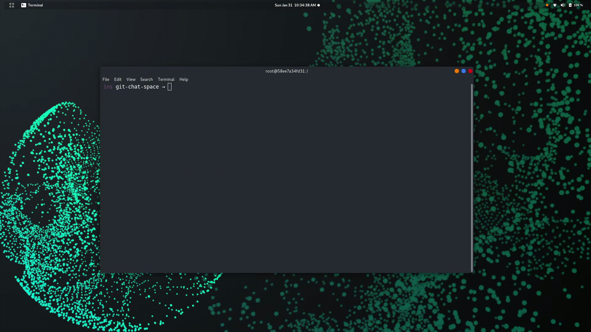

# git-chat


`git-chat` is a command-line messaging application built on the fundamentals of `Git` and `GnuPG`.

git-chat allows multiple parties to communicate securely by _committing_ messages to branches on an upstream Git repository. Textual messages are gpg-encrypted (ascii-armored) and embedded as commit messages and committed on a branch (referred as a channel). Individuals may join a channel by committing their gpg public keys, allowing others to include them as a recipient in new messages.

This project is a meme. If you're using git-chat for messaging with your savvy friends, you're an awesome person. Please do keep in mind that git-chat should not be used for secure and tamper proof communication because it suffers from tampering (lost messages, erased history, etc.). Use at your own risk.



## Building git-chat
By default, git-chat is installed into your `${HOME}`. To install, from the project root run:
```
$ cmake -B build -S .
$ make -C build all install
$ ~/bin/git-chat --version
```

For a global install, from the project root run:
```
$ cmake -B build -S . -DCMAKE_INSTALL_PREFIX=/usr/local
$ make -C build all install
$ git-chat --version
```

### Running Tests
The steps below are the very basics--just enough to get you started. For more details, see `test/README.md`.

```
$ # unit tests
$ cmake -B build/ -S .
$ make -C build/ all test

$ # integration tests
$ make -C build/ install
$ make -C build/ integration
```

## Using git-chat
`Git` has a neat way of allowing third parties to create extensions to Git that can be run as if they were builtins. If an executable on the PATH is prefixed with `git-`, git will execute it if the subcommand matches what follows after the prefix. Since git-chat is installed as an executable `git-chat`, you can invoke git-chat by simply running `git chat [args]`.

### git chat init
Initialize a new messaging space. This will call 'git init' to initialize the repository, and then setup the repository to be used for messaging.

```
usage: git chat init [(-n | --name) <name>] [(-d | --description) <desc>]
   or: git chat init [-q | --quiet]
   or: git chat init (-h | --help)

        -n, --name <name>      Specify a name for the master channel
        -d, --description <desc>
                        Specify a description for the space
        -q, --quiet            Only print error and warning messages
        -h, --help             Show usage and exit
```

### git chat import-key
Import gpg keys into the git-chat keyring and commit them to a channel.

```
usage: git chat import-key [--gpg-home <path>] [--] <key fpr>...
   or: git chat import-key (-f | --file) <path>
   or: git chat import-key (-h | --help)

    --gpg-home <path>   path to the gpg home directory
    -f, --file <path>   path to exported public key file
    -h, --help          show usage and exit

```

### git chat channel
**IN PROGRESS** Create a new channel by branching off the current point in the conversation.

### git chat message
Create a new message in the current channel. The message is encrypted with GPG. The message is not yet published, and needs to be pushed to the remote repository using `git chat publish`.

```
usage: git chat message [(--recipient <alias>)...] (-m | --message) <message>
   or: git chat message [(--recipient <alias>)...] (-f | --file) <filename>
   or: git chat message (-h | --help)

    --recipient <alias>
                        specify one or more recipients that may read the message
    -m, --message <message>
                        provide the message contents
    -f, --file <filename>
                        read message contents from file
    -h, --help          show usage and exit
```

### git chat publish
**IN PROGRESS** Push a any new messages to the remote repository.

### git chat read
Read messages in the current channel.

```
usage: git chat read [<commit hash>]
   or: git chat read (-h | --help)

    -h, --help          show usage and exit
```

### git chat get
**IN PROGRESS** Fetch any new messages from the remote repository.

### git chat config
```
usage: git chat config [--get] <key>
   or: git chat config --get-or-default <key>
   or: git chat config --set <key> <value>
   or: git chat config --unset <key>
   or: git chat config (--is-valid-key <key>) | --is-valid-config
   or: git chat config (-e | --edit)
   or: git chat config (-h | --help)

    --get               get config value with the given key
    --get-or-default    get config value with the given key, or default value if not present
    --set               create or mutate config value
    --unset             delete config value with the given key
    --is-valid-key      exit with 0 if the key is valid
    --is-valid-config   exit with 0 if the config is valid
    -e, --edit          open an editor to edit the config file
    -h, --help          show usage and exit
```

## Extending git-chat
git-chat follows a similar extension model to Git, where executables located on the PATH that are prefixed with `git-chat-` will be invoked when `git chat <extension name>` is run at the command line. This allows you to build custom plugins to git-chat.

## Contributors

|[](https://github.com/brandon1024)|[](https://github.com/omnibrian)
|:---:|:---:|
|[Brandon Richardson](https://github.com/brandon1024)| [Brian LeBlanc](https://github.com/omnibrian)